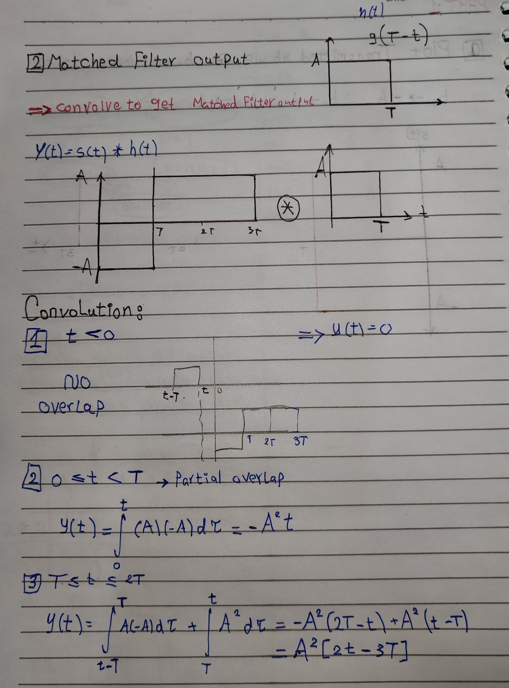
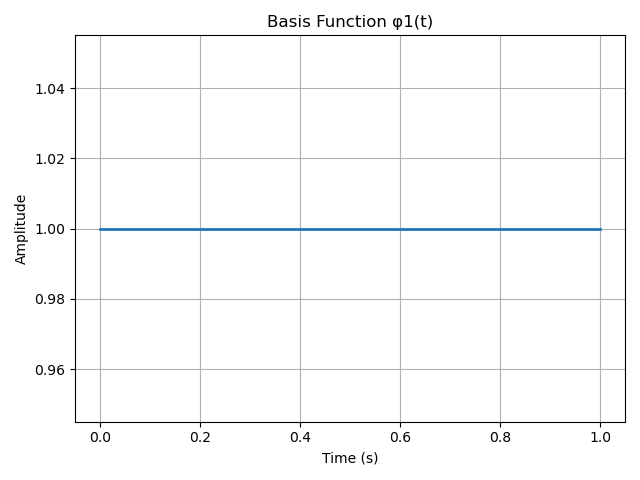
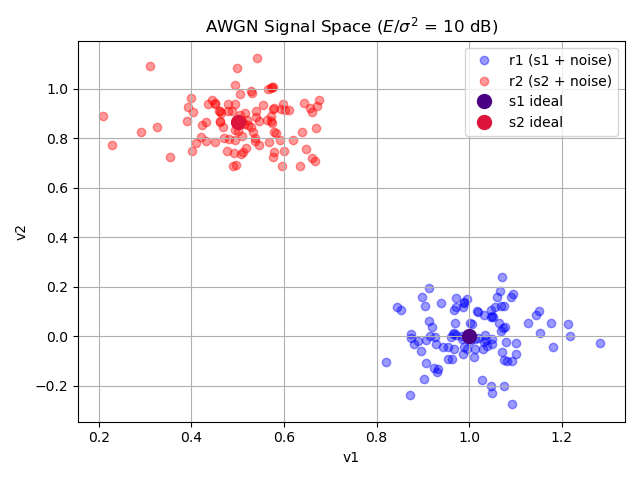

#  Digital Communication Assignments

   

 
      

##  Table of Contents

- <a href ="#about"> 📙 Overview</a>
- <a href ="#assignments"> 📝 Assignments</a>
  - <a href ="#assignment1"> ☝️ Assignment 1</a>
  - <a href ="#assignment2"> ✌️ Assignment 2</a>
  - <a href ="#assignment3"> 👌 Assignment 3</a>
- <a href ="#contributors"> ✨ Contributors</a>
- <a href ="#license"> 🔒 License</a>

##  Overview

<ul> 
<li>Solutions for Digital Communications (ELC325B) course assignments</li>
<li>This project contains implementations for 3 assignments covering:</li>
<ul>
<li>Assignment 1: Signal Quantization and SNR Analysis</li>
<li>Assignment 2: Digital Communication Systems and BER Analysis</li>
<li>Assignment 3: Signal Space Analysis and Gram-Schmidt Orthogonalization</li>
</ul>
<li>Built using Python with NumPy and Matplotlib</li>
</ul>

##  Assignments 

###  Assignment 1: Signal Quantization

This assignment explores uniform and non-uniform quantization techniques:

- Implementation of uniform quantizer and analysis of its effects on different signal types
- SNR calculations for various bit depths
- μ-law companding technique for non-uniform signals
- Comparison between midrise and midtread quantization

<table>
<tr>
<td>Quantization Comparison</td>
<td></td>
</tr>
<tr>
<td>Uniform Signal SNR</td>
<td></td>
</tr>
<tr>
<td>Non-uniform Signal SNR</td>
<td></td>
</tr>
<tr>
<td>μ-law Performance</td>
<td></td>
</tr>
</table>

###  Assignment 2: Digital Communication Systems

Analysis of digital communication systems with various filter configurations and BER analysis:

<table>
<tr>
<td></td>
<td></td>
<td></td>
</tr>
</table>

###  Assignment 3: Signal Space Analysis

Implementation of Gram-Schmidt orthogonalization and signal space representation:

<table>
<tr>
<td>Original Signals</td>
<td></td>
<td></td>
</tr>
<tr>
<td>Orthogonal Basis</td>
<td></td>
<td></td>
</tr>
<tr>
<td>Signal Space (Clean)</td>
<td colspan="2"></td>
</tr>
<tr>
<td>Noisy Signal Space</td>
<td></td>
<td></td>
</tr>
</table>

##  Contributors

<table>
  <tr>
    <td align="center">
      <a href="https://github.com/amir-kedis"> 
      <b>Amir Kedis</b></a> 
    </td>
    <td align="center">
      <a href="https://github.com/akramhany"> 
      <b>Akram Hany</b></a> 
    </td>
  </tr>
</table>

## 🔒 License 

This software is licensed under MIT License. See [License](LICENSE) for more information.